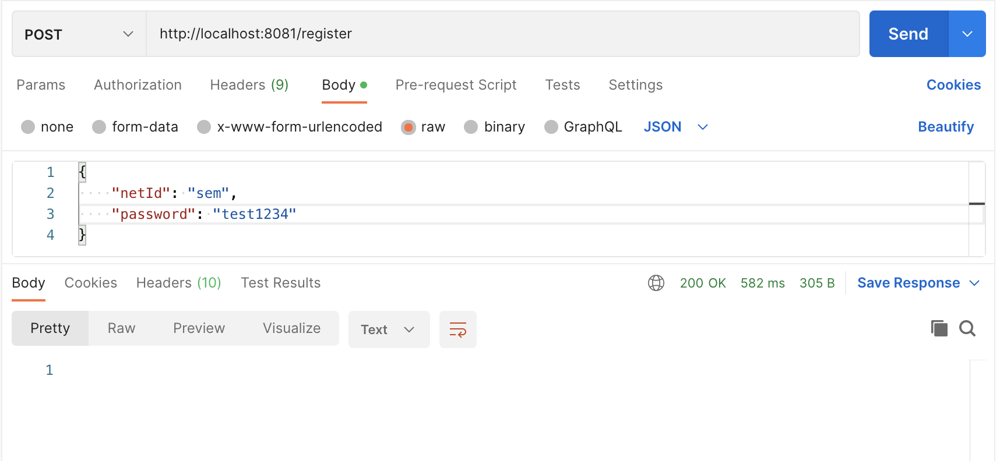
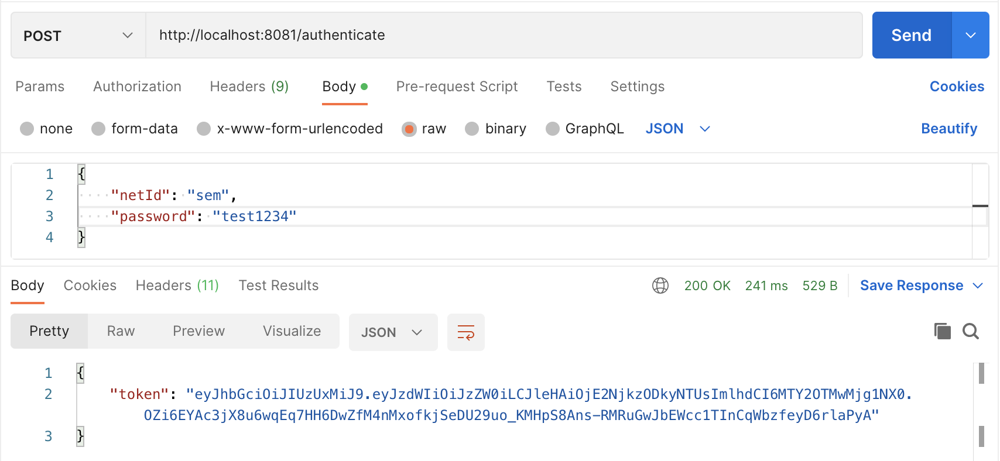

# Description
This project was done by a group of six people, we developed an online book reading application, which focused on back-end logic implementation. The application allows different roles of users to post or manage the books, mark their reading status of books and share them with their friends, and search books and then add them to their lists. Used Spring Framework in Java, REST for server interactions, and Mockito for integration testing. During the development, we used Postman to test the endpoints. 

# Lab Template

This template contains two microservices:
- authentication-microservice
- example-microservice

The `authentication-microservice` is responsible for registering new users and authenticating current ones. After successful authentication, this microservice will provide a JWT token which can be used to bypass the security on the `example-microservice`. This token contains the *NetID* of the user that authenticated. If your scenario includes different roles, these will have to be added to the authentication-microservice and to the JWT token. To do this, you will have to:
- Add a concept of roles to the `AppUser`
- Add the roles to the `UserDetails` in `JwtUserDetailsService`
- Add the roles as claims to the JWT token in `JwtTokenGenerator`

The `example-microservice` is just an example and needs to be modified to suit the domain you are modeling based on your scenario.

The `domain` and `application` packages contain the code for the domain layer and application layer. The code for the framework layer is the root package as *Spring* has some limitations on were certain files are located in terms of autowiring.

## Running the microservices

You can run the two microservices individually by starting the Spring applications. Then, you can use *Postman* to perform the different requests:

Register:

Authenticate:

Hello:

## Team memebers
1. Rebecca Andrei - N.R.Andrei@student.tudelft.nl
2. Di Wu - D.Wu-7@student.tudelft.nl
3. Daria Elena Bucur - D.E.Bucur@student.tudelft.nl
4. Noky Soekarman - N.P.Soekarman@student.tudelft.nl
5. Leonardo Marcuzzi - L.Marcuzzi@student.tudelft.nl
6. Miruna Negoitescu - M.C.Negoitescu@student.tudelft.nl
